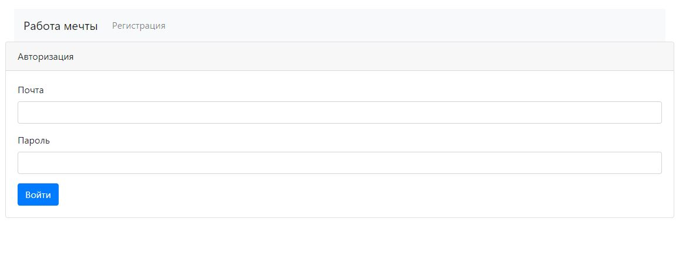
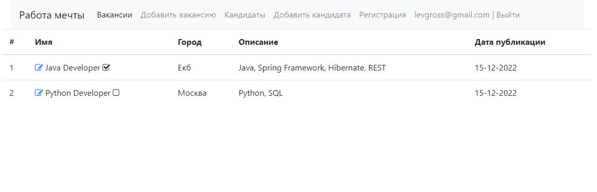
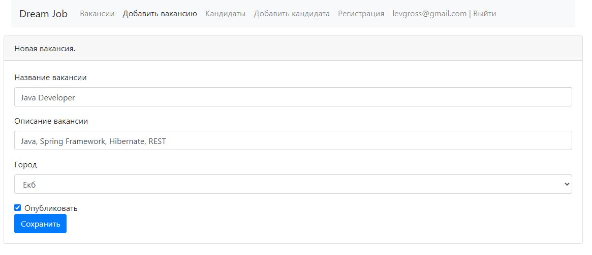
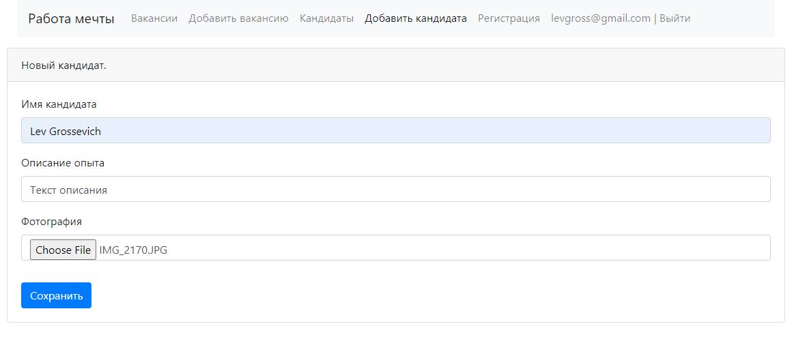

# job4j_dreamjob











## О проекте
В системе есть два типа пользователей: кандидаты и кадровики.
Кандидаты публикуют резюме.
Кадровики публикуют вакансии о работе.

Кандидаты могут откликнуться на вакансию. Кадровик может пригласить на вакансию кандидата.

## Использованные технологии
- Java 17
- Maven 4.0.0
- Spring boot 2.7.3
- PostgreSQL 14.2
- Liquibase 4.15.0
- Thymeleaf
- Bootstrap
- Junit 5.9.0
- AssertJ 3.23.1

## Настройка окружения
Установить:
- PostgreSQL 14.2
- JDK 17.0.1
- Maven 4.0.0

## Запуск проекта
Создать базу данных
```
createdb --username=ИМЯ dreamjob
```

Запустить командой
```
mvn spring-boot:run
```

Перейти по ссылке http://localhost:8080/posts